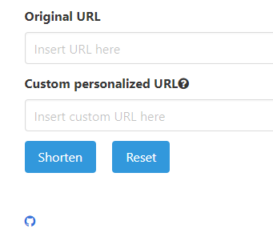
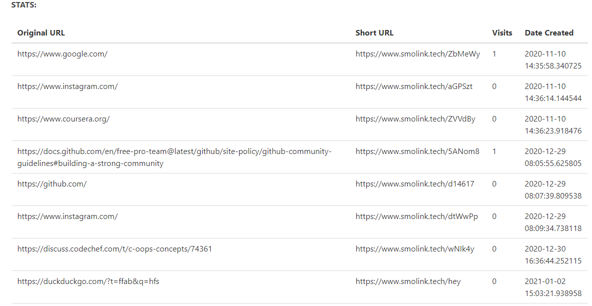

# URL_Shortener - smolink


## Access the service [here](https://smolink.herokuapp.com/) or [here](https://smolink.pythonanywhere.com/)


[](https://github.com/ellerbrock/open-source-badges/)
[](http://makeapullrequest.com)


This project was born out of my curiosity for how URL Shorteners work.

This is a simple **URL shortener** in Flask.

Shortens URL upto length 512 characters to 6 characters.

Made using Flask-SQLAlchemy. This URL shortener will be able to redirect links and keep stats on the number of times each link was visited.

Also has **[HTTP Basic Authentication](https://web.archive.org/web/20190128010144/http://flask.pocoo.org/snippets/8/)** to view stats.

**All this data will be stored in a [sqlite3](https://www.sqlite.org/index.html) database**


### Goals of this project

:white_check_mark: Users can create personalized URLs 

:white_check_mark: Check user input to make sure it's URL

:white_check_mark: Support for ftp[s]

:white_check_mark: Ability to view stats for individual links by adding "/stats" to URL

:white_check_mark: Public HTTPS website deployed

* [ ] User can create a account and then generate and manage all the links and their stats from there

* [ ] Security against cyber attacks

(more will be added along the way)


* **"link" Table in the Database**


## User Interface

* **UI walk-through**


* **Index page**


* **Short URL generated**


* **Custom Short URL generated**


* **Incase custom selected URL already exists**


* **Individual link Statistics**


* **Global Statistics (Needs admin HTTP Authentication)**


## Quick Setup:

- Fork and Clone the repository using-
```
git clone https://github.com/ksh168/smolink-url_shortener.git
```

Always recommended to create a virtual environment

##### Method1: (Recommended)
> ```sudo apt install python3-venv```

> Create a virtual environment called **myvenv**

	```python3 -m venv ./myvenv```

> Activate myvenv

	```source myvenv/bin/activate```

> Install dependencies

	```pip install -r requirements.txt```

##### Method2:
> Create **virtual environment** and install flask

	```pipenv install flask```

> To **start shell** and enter the venv

	```pipenv shell```

> **Dependencies:**(this step might not be needed)

	```pipenv install python-dotenv```

	```pipenv install sql-alchemy```

> To **run the app**

	**start shell** if not started
	```pipenv shell```

	```flask run```
	
- Now headover to Project Directory- 
```
cd smolink-url_shortener
```
- Create a Branch- 
```
git checkout -b <branch_name>
```

### Now to create the database
1. Start python in terminal

	```python```

2.
	```python
		from url_shortener import create_app
	```

3.
	```python
		from url_shortener.extensions import db
	```

4.
	```python
		from url_shortener.models import Link
	```

5. **To create tables and database**

	```python
		db.create_all(app = create_app())
	```

6. To exit python console

	```python
		exit()
	```


* To **view database**, write in terminal

	`sqlite3 url_shortener/db.sqlite3`

* To **see the table names** in database

	```sql
		.tables
	```


* To **query the database**

	```sql
	SELECT * FROM link;
	```
* To **delete table contents but not table**

	```sql
	DELETE FROM link;
	```

* To exit sqlite3

	```sql
		.exit
	```


## Contributing

Checout the [contributing guide](CONTRIBUTING.md)

## Community
* You can chat with the community [here](https://github.com/ksh168/smolink-url_shortener/discussions) or [here](https://discord.gg/8nGszwFKS6).


## Acknowledgements

This project was made using **[GitHub Codespaces Beta](https://github.com/features/codespaces)**. Thanks to them for providing me early access to their such beautiful and useful feature.

[](https://github.com/ksh168/smolink-url_shortener/graphs/contributors)
